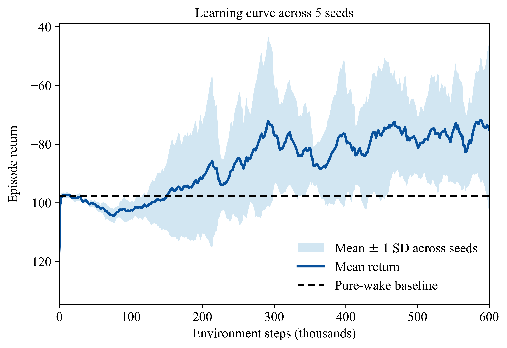
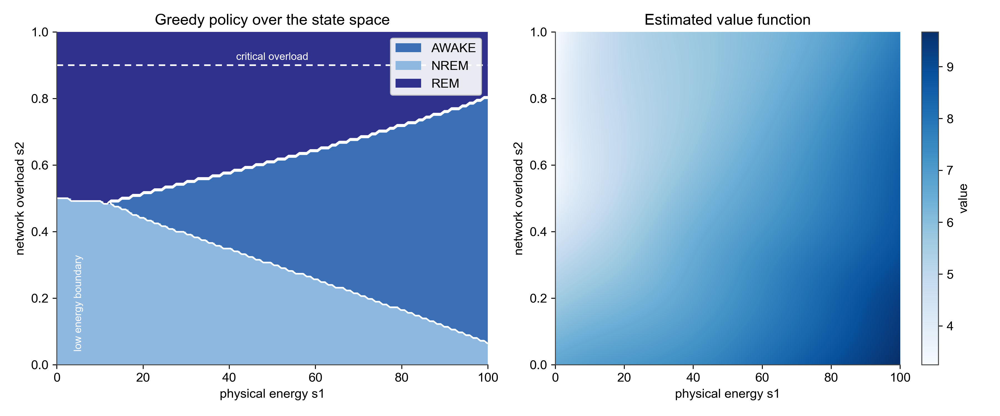
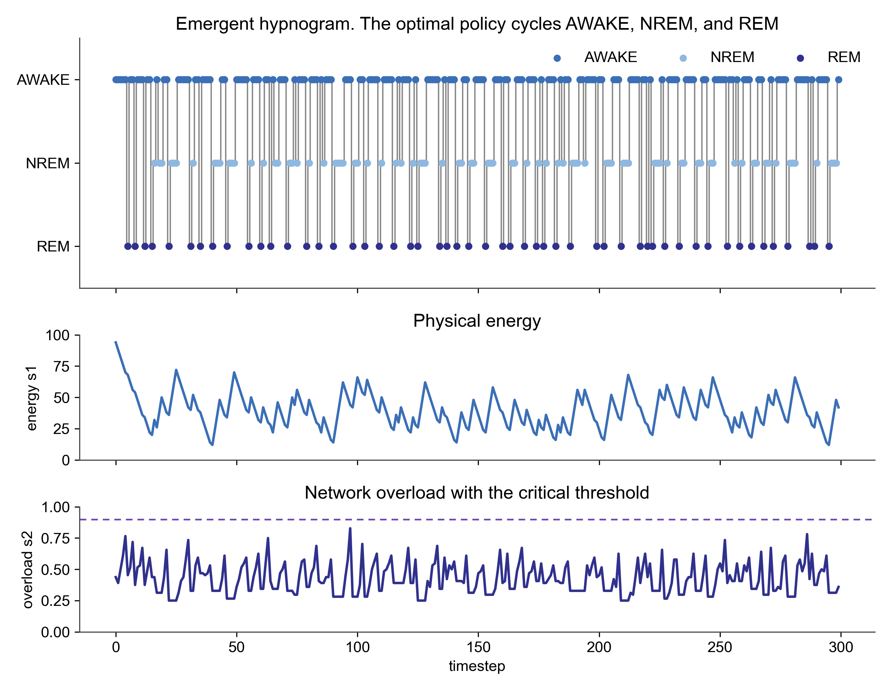
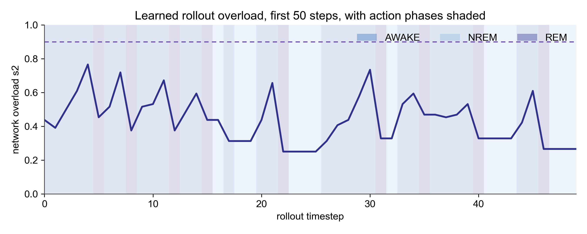

# Cric RL Sleep Model

### Sleep as Optimal Hardware Management

An agent with a Hopfield network for a brain and a finite battery for a body is paid only to stay awake. It is never told to sleep. Trained with A2C, it discovers that it must, and it discovers a three state cycle of waking, recharging, and offline pruning as the reward maximising way to stay alive.

This repository contains the reinforcement learning environment, the trained agent, and the analysis behind that claim.

All numbers quoted below were measured from the code in this repository at the default configuration with seed 0.

---

## Contents

1. [The hardware and its flaw](#1-the-hardware-and-its-flaw)
2. [The constrained Markov decision process](#2-the-constrained-markov-decision-process)
3. [The mean field argument](#3-the-mean-field-argument)
4. [How the code implements the model](#4-how-the-code-implements-the-model)
5. [Results](#5-results)
6. [What REM is actually doing](#6-what-rem-is-actually-doing)
7. [Limitations and open items](#7-limitations-and-open-items)
8. [References](#8-references)

---

## 1. The hardware and its flaw

The model rests on two papers published back to back in Nature in July 1983.

Crick and Mitchison proposed that REM sleep exists to remove parasitic modes of activity from the cortex. Because associations are superimposed on shared synapses, a network that keeps learning inevitably develops attractors that nobody ever stored. Their proposed mechanism is reverse learning, run on quasi random activations while the cortex is isolated from its inputs. We dream in order to forget.

Hopfield, Feinstein and Palmer supplied the mathematics. In a network of $N$ binary neurons with symmetric weights

$$T_{ij} = \sum_{s} \mu_{i}^{s} \mu_{j}^{s}, \qquad T_{ii} = 0,$$

up to roughly $n \le 0.25 N$ patterns can be made stable states. Learning also creates spurious stable states. Unlearning is implemented by relaxing the network from a random start to a fixed point $\mu^{f}$ and applying

$$\Delta T_{ij} = -\epsilon\, \mu_{i}^{f} \mu_{j}^{f}, \qquad 0 < \epsilon \ll 1 .$$

The argument for why this works is geometric. Deep energy valleys are also broad, so a random start lands preferentially in the largest basins, and the largest basins are disproportionately spurious. Unlearning therefore raises the energy of spurious states and equalises the accessibility of the real ones. Hopfield and colleagues also record the warning that this model takes seriously: too much unlearning will ultimately destroy the stored memories.

This repository asks a question neither paper asks. If cleaning the network is expensive, and being awake is what earns reward, when should an agent choose to clean? The answer is not assumed anywhere in the code. It is learned.

---

## 2. The constrained Markov decision process

### A. State space

The agent observes two scalars.

1. $s_{1} \in [0, 100]$ is physical energy. It falls during waking and during offline pruning, and it recovers during rest.
2. $s_{2} \in [0, 1]$ is network overload. Operationally it is the fraction of a fixed bank of 64 random probe states which, after relaxing in the current weight matrix, do not settle within 0.95 overlap of any protected memory or its mirror image.

An important point about $s_{2}$, which is easy to misread. It is not the density of spurious minima created by learning. It is the fraction of probe space that the protected memories do not own, and it has a floor. With eight protected patterns written and nothing else learned, $s_{2}$ already sits at about 0.41. Eight attractors cannot capture most of a state space of size $2^{100}$. Learning drives $s_{2}$ above that floor, and pruning drives it back toward it.

### B. Action space

The agent chooses exactly one of three mutually exclusive modes per timestep.

1. **AWAKE.** One fresh random experience is written into the labile store by a Hebbian update, $\Delta T_{ij} \propto \mu_{i} \mu_{j}$. The agent harvests the waking reward, spends energy, and raises overload.
2. **NREM.** No synaptic update of any kind. Energy recovers. Overload is exactly static, which is provable rather than approximate, because the weight matrix is untouched and the overload measurement is deterministic.
3. **REM.** The agent isolates itself from input, relaxes random noise into the network's own attractors, and applies a reverse Hebbian update to those fixed points. Overload falls sharply at a small energy cost.

| Action | Function | Energy $s_{1}$ | Overload $s_{2}$ |
| --- | --- | --- | --- |
| AWAKE | Learn and exploit | Falls by 6 | Rises |
| NREM | Rest and recharge | Rises by 12 | Exactly static |
| REM | Unlearn and prune | Falls by 2 | Falls |

### C. Reward

$$r_{t} = r_{\text{wake}} \cdot \mathbf{1}[a_{t} = \text{AWAKE}] \; - \; \lambda\, s_{2} \; - \; c_{\text{idle}} \cdot \mathbf{1}[a_{t} \neq \text{AWAKE}] \; - \; 100 \cdot \mathbf{1}[\text{death}]$$

with $r_{\text{wake}} = 1$, $\lambda = 1$, and $c_{\text{idle}} = 0.1$. Death occurs if energy reaches zero, or if overload crosses the critical threshold $s_{2} \ge 0.9$. Episodes truncate after 300 steps.

Note that the overload penalty is charged on every step, including offline steps. Sleeping does not exempt the agent from the cost of a cluttered brain. That is what makes pruning worth paying for rather than merely tolerable.

---

## 3. The mean field argument

Let $a$, $n$ and $\rho$ be the long run fractions of time spent AWAKE, in NREM and in REM, with

$$a + n + \rho = 1 .$$

Approximate the dynamics of the two state variables as

$$\frac{ds_{1}}{dt} = r_{n} n - c_{a} a - c_{r} \rho, \qquad \frac{ds_{2}}{dt} = \beta a (1 - s_{2}) - \kappa \rho\, s_{2} ,$$

where $r_{n}$ is the recharge rate, $c_{a}$ and $c_{r}$ are the energy costs of waking and of pruning, $\beta$ is the rate at which waking accumulates clutter, and $\kappa$ is the rate at which pruning clears it.

### Result 1. Pure wakefulness is fatal

Set $a = 1$ and $n = \rho = 0$. The overload equation becomes

$$\frac{ds_{2}}{dt} = \beta (1 - s_{2}) > 0 \quad \text{for all } s_{2} < 1 .$$

Overload rises without bound below 1 and must cross the critical threshold. Death is certain, and it is death by clutter rather than by exhaustion.

### Result 2. Any waking at all forces both sleep stages

Suppose the agent wakes at all, so $a > 0$, and suppose an interior steady state exists, so that both derivatives vanish.

From $ds_{2} / dt = 0$ we get

$$\beta a (1 - s_{2}^{\ast}) = \kappa \rho\, s_{2}^{\ast} .$$

The left hand side is strictly positive because $a > 0$, therefore $\rho > 0$. **Waking forces REM.**

From $ds_{1} / dt = 0$ we get

$$r_{n} n = c_{a} a + c_{r} \rho .$$

The right hand side is now strictly positive because both $a > 0$ and $\rho > 0$, therefore $n > 0$. **Waking and REM together force NREM.**

### What this proves, and what it does not

It proves that conditional on the agent doing any waking at all, all three states must be used with positive frequency. The three state cycle is the unique interior fixed point of any policy that earns reward.

It does not prove that the three state cycle is the only survivable policy. The degenerate policy $a = 0$, which sleeps forever and never wakes, is survivable. The simulation confirms this: a scripted pure NREM agent survives all 300 steps. It simply earns nothing and pays the frozen clutter tax forever, returning $-152$. Sleep only is survivable. It is merely worthless.

It also does not prove any ordering of the states. A mean field argument constrains time fractions and is silent on sequence. Any claim about the sequential architecture of sleep has to be read off the learned policy, not off this algebra. Section 5 does exactly that.

---

## 4. How the code implements the model

- **The brain.** A Hopfield network of $N = 100$ neurons. The weight matrix is the sum of two additive stores, a consolidated store holding the eight protected evaluation memories, and a labile store holding transient experience. The network dynamics see only the sum, so the memories are genuinely superimposed. REM acts on the labile store alone.
- **The declared liberty.** Because the consolidated store is protected from REM, this model cannot be used as evidence that unlearning is safe for real memories. It is safe here because it was made safe by construction. This corresponds biologically to the claim that consolidated memories are shielded from offline downscaling, which is an assumption, not a result of this model.
- **The agent.** Advantage Actor Critic with generalised advantage estimation. A shared tanh trunk of two 128 unit layers feeding a policy head and a value head. The agent's only input is the two dimensional observation. It is trained for 600,000 environment steps, roughly 5,600 episodes.
- **The incentive.** The agent is never hardcoded or instructed to sleep. Its untrained policy is effectively greedy. It tries to stay awake and farm the waking reward.
- **What AWAKE actually stores.** At the current experience weight, a single presentation does not create a retrievable attractor. Relaxing six imprinted experience patterns back into the network gives self overlaps of 0.30, 0.40, 0.36, 0.36, 0.48 and 1.00, against 0.94 to 1.00 for the protected memories. Only the most recent experience is stable. AWAKE therefore injects clutter rather than storing usable memory. This model is a clean test of the clutter accumulation half of the Crick and Mitchison hypothesis. It says nothing about consolidation.

---

## 5. Results

### A. The scripted baselines

| Policy | Steps survived | Cause of death | Return |
| --- | --- | --- | --- |
| Pure AWAKE | 12 | Overload | $-96$ |
| Pure REM | 50 | Energy | $-120$ |
| Pure NREM | 300 | Survived | $-152$ |
| Learned policy | 300 | Survived | roughly $-30$ to $-60$ |

The pure AWAKE run is the empirical form of Result 1. The agent dies at step 12 with 28 units of battery still in the tank. It is killed by clutter, not by exhaustion, which is precisely the mechanism the theory predicts and precisely the thing that separates this model from an ordinary energy homeostasis task. Over those twelve steps overload climbs from 0.438 to 0.953 and recall accuracy falls from 1.00 to 0.25.

Overload under pure wakefulness is not monotone in the simulation. The measured trace is 0.438, 0.391, 0.500, 0.609, 0.766, 0.703, 0.875, 0.781, 0.797, 0.891, 0.891, 0.953. It is a noisy upward random walk with an absorbing boundary. Monotonicity is a property of the mean field equation, not of the sampled process.

### B. The learning curve

Training passes through three regimes.

**Episodes 0 to about 2000.** The moving average of episode return sits flat on the pure AWAKE baseline at about $-95$, and episode length collapses to about 20 steps. The agent has learned to do exactly the greedy thing and to die of it. This is not a training failure. It is the model reproducing Result 1 empirically.

**Episodes 2000 to about 3200.** Variance explodes before the mean improves. Individual episodes begin to reach far above and far below the baseline. The agent is finding, by exploration, that offline actions delay death, while still frequently mistiming them.

**After about episode 3200.** The moving average lifts clear of the baseline and settles into a noisy plateau, oscillating roughly between $-80$ and $-25$. Episode length climbs into a band between roughly 100 and 240 steps. The best individual episodes clear $+20$.

The learned policy beats the greedy baseline by roughly 50 to 70 return units. It does not converge. The moving average is still oscillating at 5,600 episodes and episode length never pins to the 300 step cap. The likely cause is that the problem is partially observed: the agent sees two numbers, while the true state of the system includes a $100 \times 100$ weight matrix. Two networks with the same $s_{2}$ can respond differently to the next REM step. The critic is therefore fitting a target that is not a function of its input, which places a floor under the residual variance that more training will not remove.

### C. The learned policy map

Plotting the greedy action across the two dimensional state space produces three clean regions.

**AWAKE** occupies a wedge that opens toward high energy. The agent is willing to be awake only when it has both energy and a sufficiently clean network.

**NREM** occupies the region where overload is below about 0.5 and energy is low. Its boundary slopes downward, from roughly $(s_{1} = 0,\, s_{2} = 0.5)$ to roughly $(s_{1} = 100,\, s_{2} = 0.07)$. Read in the other direction, the higher the clutter, the sooner the agent must recharge, because the clutter tax makes every step expensive and it needs reserve.

**REM** occupies everything above a boundary that slopes upward, from roughly $(s_{1} = 0,\, s_{2} = 0.5)$ to roughly $(s_{1} = 100,\, s_{2} = 0.8)$.

The critical observation is that the REM threshold is an increasing function of energy. At a full battery the agent tolerates clutter up to about $s_{2} = 0.8$ before it cleans. At an empty battery it cleans as soon as $s_{2}$ exceeds about 0.5. The REM region expands as energy falls.

The mechanism is asymmetry of repair. Energy has a repair path, namely NREM. Overload does not, because NREM cannot lower $s_{2}$ and only REM can. Overload is therefore the strictly more dangerous of the two failure modes, and an agent that is poor in energy becomes less willing to gamble on clutter, not more. An agent rich in energy can afford to postpone housekeeping and keep farming reward.

### D. The emergent cycle, and how it differs from the mammalian one

Trace the flow through the policy map. Starting from the top right of the AWAKE wedge, energy falls by 6 per step while overload climbs by roughly 0.1 per step, so the state moves up and to the left. It crosses the REM boundary well before it reaches the NREM boundary. The modal cycle this policy implements is therefore

$$\text{AWAKE} \rightarrow \text{REM} \rightarrow \text{NREM} \rightarrow \text{AWAKE}$$

and not the mammalian order of AWAKE, NREM, REM.

This is stated as a finding rather than hidden as a failure. The agent triages the irreversible risk before the reversible one. In mammals the ordering runs the other way, and the standard explanation is that REM is expensive and cannot be afforded on a depleted system, so a period of non-REM has to be paid first. In this model REM is cheap, costing 2 energy units against 6 for waking, so no such toll gate exists. Whether raising the REM energy cost is sufficient to flip the ordering is a single parameter experiment and is listed as an open item in section 7.

### E. The hypnogram

Over a 300 step greedy rollout, energy oscillates in a sawtooth between roughly 12 and 70 and never reaches zero. Overload oscillates between roughly 0.25 and 0.83 and never crosses 0.9, though it comes close twice. Two coupled variables are held inside their safe corridors by a bang bang controller, and no setpoint for either appears anywhere in the reward function. This is a homeostat that was not designed, only incentivised.

The bouts are one to five steps long. This is a micro sleep controller, not a consolidated mammalian sleep architecture, and it is exactly what should be expected. There is no cost of switching state in this model, so there is no pressure toward consolidated bouts. Mammalian sleep is consolidated because state transitions are expensive and the underlying switch has hysteresis. Adding a switching cost and measuring how bout length grows with it is the natural next experiment, and it is listed in section 7.

### F. The overload trace with actions shaded

The clearest evidence that the environment does what it claims. Over the first 50 steps of the learned rollout, each run of AWAKE corresponds to a monotone climb in overload, each REM step corresponds to a sharp drop, and each NREM step corresponds to an exactly flat segment. The three actions have three visually distinct signatures and the action can be identified from the overload trace alone.

The agent runs with a thin safety margin, peaking at about 0.77 against a death threshold of 0.9. That is not carelessness. The clutter tax is linear in $s_{2}$, so there is no reason to hold overload far below the threshold except to insure against the terminal penalty. The margin the agent selects is the price it puts on that penalty.

---

## 6. What REM is actually doing

The REM operation in this code performs two updates on the labile store in the same step:

$$T^{\text{lab}} \leftarrow (1 - \rho_{\text{rem}}) \, T^{\text{lab}}, \qquad \rho_{\text{rem}} = 0.3$$

$$T^{\text{lab}}_{ij} \leftarrow T^{\text{lab}}_{ij} - \epsilon \sum_{f} x_{i}^{f} x_{j}^{f}, \qquad \epsilon = 8 \times 10^{-4}$$

where the $x^{f}$ are six random states relaxed to the network's own fixed points.

Only the second update is the Crick and Mitchison and Hopfield mechanism. The first is a uniform multiplicative downscaling of everything recently learned, and it has no counterpart in either source paper. It is closer in spirit to the synaptic homeostasis hypothesis of Tononi and Cirelli, which is a competing account of sleep function.

Separating them matters, so they were separated. Starting from a network loaded with six AWAKE steps, then run for eight offline steps:

| Variant | $s_{2}$ after 1 step | $s_{2}$ after 8 steps | Recall after 8 steps |
| --- | --- | --- | --- |
| Full REM, $\rho = 0.3$, $\epsilon = 8 \times 10^{-4}$ | 0.484 | 0.312 | 1.000 |
| Downscaling only, $\rho = 0.3$, $\epsilon = 0$ | 0.562 | 0.406 | 1.000 |
| Reverse learning only, $\rho = 0$, $\epsilon = 8 \times 10^{-4}$ | 0.688 | 0.500 | 1.000 |
| Reverse learning only, $\rho = 0$, $\epsilon = 8 \times 10^{-3}$ | 0.703 | 0.000 | 0.125 |

The mean absolute magnitude of the downscaling update in a single REM step is $8.23 \times 10^{-3}$, against $2.86 \times 10^{-3}$ for the reverse Hebbian update. The downscaling term is roughly three times larger, and it is also directed, since it always removes labile weight, whereas the reverse Hebbian term is a sum of random sign outer products that partially cancels.

Two conclusions follow, and both are stated plainly rather than buried.

First, **at the default parameters the downscaling term does most of the work.** The claim that REM in this model implements Crick and Mitchison unlearning is too strong. What the agent selects is an offline phase that combines downscaling with reverse learning, and the two components are separable and both contribute.

Second, and more interestingly, **the last row of that table reproduces Hopfield's warning exactly.** At ten times the unlearning rate, the network is cleaned perfectly, overload falls to zero, and recall collapses from 1.000 to 0.125. Too much unlearning destroys the stored memories. That is a dose response curve for reverse learning, obtained in a model that was not built to look for it, and it is arguably the strongest single result in this repository.

---

## 7. Limitations and open items

Stated openly, because each one is a question a reader will ask.

1. **The relaxation is synchronous and does not fully converge.** The network is relaxed with `s = sign(s @ W)` applied to all neurons at once, for ten sweeps. Hopfield's dynamics are asynchronous, and asynchrony is what guarantees monotone energy descent to a fixed point. Synchronous updates admit period two limit cycles. Measured on a loaded network, only 71.9 percent of probes are at a true fixed point after ten sweeps, and 6.2 percent are trapped in a two cycle. A probe that has not converged is unlikely to lie near a memory, so non convergence inflates $s_{2}$. Switching to asynchronous updates is the correct fix. The qualitative results are not expected to change, but the absolute values of $s_{2}$ will move.
2. **The truncation bootstrap in the A2C update is incorrect.** When an episode truncates at 300 steps, the environment is reset before the next observation is buffered, so the advantage estimator bootstraps from the value of the new episode's reset state rather than the value of the truncated episode's final state. The effect is small, because the reset state has a value similar to a typical mid episode state, but it is a real bug.
3. **The NREM control arm in the mechanism figure is analytic, not simulated.** It is written as a constant, which is provably the correct value, since NREM applies no synaptic update and the recall measurement is deterministic. It should nevertheless be produced by actually stepping the environment, so that it is a control in fact and not only in principle.
4. **The problem is partially observed.** The agent sees two scalars while the true state includes the full weight matrix. This is a deliberate modelling choice and is almost certainly why the learning curve plateaus noisily rather than converging.
5. **Ordering.** Whether raising the REM energy cost is sufficient to produce the mammalian AWAKE, NREM, REM ordering is untested. Section 5D predicts that it should.
6. **Bout consolidation.** Adding a cost of switching between states should lengthen bouts. This is the missing bridge between the micro sleep controller reported here and a mammalian hypnogram, and it is a one parameter experiment.

---

## 8. References

Crick, F. and Mitchison, G. (1983). The function of dream sleep. *Nature* 304, 111 to 114.

Hopfield, J. J., Feinstein, D. I. and Palmer, R. G. (1983). Unlearning has a stabilizing effect in collective memories. *Nature* 304, 158 to 159.

Hopfield, J. J. (1982). Neural networks and physical systems with emergent collective computational abilities. *Proceedings of the National Academy of Sciences* 79, 2554 to 2558.
