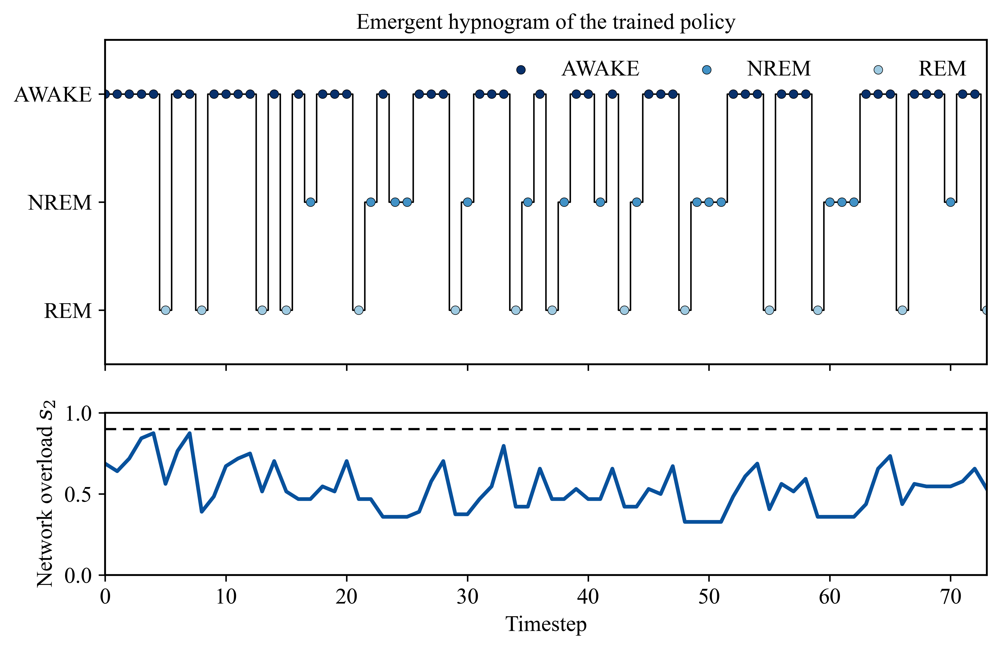

# Emergence of a Three State Sleep Cycle in a Reinforcement Learning Agent with a Hopfield Memory and a Finite Energy Budget

Sleep is never defined, rewarded, or scripted, yet an agent paid only to stay awake learns to sleep.

Sanjana Singh, Department of Cognitive and Brain Sciences, IIT Gandhinagar.
Palika Charitha and V. Srinivasa Chakravarthy, Computational Neuroscience Lab, IIT Madras.

## Overview

A Hopfield network of 100 binary neurons is coupled to a finite energy budget. An Advantage Actor Critic agent is paid only for remaining awake. Sleep is never defined and appears in neither the action semantics nor the reward function, yet the agent learns a policy that partitions its two dimensional state space into three regions, cycles between three states, and holds both state variables inside safe corridors for which no setpoint exists anywhere in the reward. The clutter half of the problem, keeping the memory readable, is solved in every seed we ran. The energy half is not yet stable across seeds. The framing question comes from Crick and Mitchison (1983) and Hopfield, Feinstein and Palmer (1983).

## The model

### Memory substrate

The weight matrix is the sum of two additive stores. A consolidated store `Tc` holds eight protected evaluation memories and is never modified during an episode. A labile store `Tl` holds transient experience. The network dynamics see only the sum `Tc + Tl`, so the memories are genuinely superimposed. REM acts on `Tl` alone; the consolidated store is screened from it by construction.

### State

The agent observes two scalars.

- `s1`, physical energy, in the range `[0, 100]`. It falls during waking and during REM, and it recovers during NREM.
- `s2`, network overload, in the range `[0, 1]`. It is defined on a fixed bank of 64 random probe states as the fraction of probe space that the real memories do not own. Operationally, each probe is relaxed in the current weight matrix, and a probe counts as overload if it does not settle within 0.95 overlap of any protected memory or its mirror image.

### Actions

The agent chooses one of three mutually exclusive modes per timestep.

- AWAKE. Writes one fresh random experience into the labile store by a Hebbian update, earns the waking reward, and spends 6 units of energy. This raises overload.
- NREM. Applies no synaptic update at all. It is an identity operation on the weight matrix, so overload is exactly static. Energy recovers by 12 units.
- REM. Relaxes six random states to fixed points, then applies a multiplicative downscale `d = 0.7` to the labile store together with a reverse Hebbian update at rate `epsilon = 8e-4` on those fixed points. This lowers overload and costs 2 units of energy.

### Reward and termination

```
reward = 1[awake] - lambda * s2 - 0.1 * 1[not awake] - 100 * 1[death]
```

with `lambda = 1`. The overload penalty is charged on every step, including offline steps. Death occurs when `s1 <= 0` or when `s2 >= 0.9`. Episodes truncate after 300 steps.

## Results

We ran a sweep of 5 independent seeds (1, 2, 3, 5, 42), each trained for 600,000 environment steps. Uncertainty below is mean plus or minus one sample standard deviation across seeds.

### Learning curve


Figure 1: learning_curve.png. Episode return across training, aggregated over five seeds. Solid line is mean return on a common environment step grid, shaded band is plus or minus one standard deviation across seeds. Dashed line is the pure waking baseline at -97.63.

### Aggregate metrics

| Metric | Mean plus or minus SD |
| --- | --- |
| Pure wake baseline return | -97.63 +/- 0.78 |
| Trained eval return | -77.11 +/- 50.91 |
| Tail mean return (last 15%) | -76.71 +/- 16.13 |
| Trained eval length (of 300) | 121.60 +/- 110.00 |
| Mean overload s2 | 0.56 +/- 0.10 |
| Mean recall | 0.98 +/- 0.01 |
| Action count AWAKE | 69.60 +/- 58.15 |
| Action count NREM | 30.80 +/- 33.72 |
| Action count REM | 21.20 +/- 18.20 |

### Per seed

| Seed | Episodes | Baseline return | Eval return | Eval length | Terminal cause | Tail mean return | Mean overload | Mean recall | AWAKE / NREM / REM |
| --- | --- | --- | --- | --- | --- | --- | --- | --- | --- |
| 1 | 8084 | -96.872 | -102.181 | 148 | energy | -81.064 | 0.539 | 0.998 | 84 / 38 / 26 |
| 2 | 5719 | -96.859 | 13.884 | 300 | survived | -50.172 | 0.455 | 0.988 | 164 / 86 / 50 |
| 3 | 10722 | -97.594 | -97.044 | 18 | energy | -91.137 | 0.714 | 0.958 | 16 / 0 / 2 |
| 5 | 8213 | -98.425 | -98.625 | 74 | energy | -74.278 | 0.535 | 0.981 | 44 / 16 / 14 |
| 42 | 9194 | -98.419 | -101.566 | 68 | energy | -86.900 | 0.570 | 0.976 | 40 / 14 / 14 |

### Policy map


Figure 2: policy_map.png. Greedy action over the state space (left) and critic value function (right), rendered from seed 5, the representative seed whose tail mean return is closest to the group mean.

### Hypnogram



Figure 3: hypnogram.png. Greedy rollout of the trained policy, seed 5. Top panel is the emergent hypnogram, bottom panel is network overload s2 against the critical threshold at 0.9.

### What the numbers say

The trained policy beats the pure waking baseline in every seed. In each seed the trained evaluation return exceeds that seed's own pure waking baseline return.

The clutter half of the problem is solved in every seed. Mean recall is 0.98 plus or minus 0.01 and mean overload is 0.56 plus or minus 0.10, against a death threshold of 0.9. The memory stays readable and the network never dies of clutter.

The energy half is not yet stable. Only seed 2 survives the full 300 step horizon, and it ends with a positive return of 13.88. The other four seeds terminate on energy depletion, between step 18 and step 148.

Seed 3 is a distinct failure mode, not just a short rollout. Its greedy rollout selects NREM zero times, so it has no refuelling path and expires at step 18.

The modal cycle read off the policy map is `AWAKE -> REM -> NREM`, which inverts the mammalian order `AWAKE -> NREM -> REM`. The reason is the cost structure. REM costs 2 energy units, a sixth of what one NREM step returns, so no refuel toll has to be paid before clutter can be cleared, and overload is the only irreversible failure mode. The agent triages the irreversible risk first.

Offline bouts run 1 to 5 steps. There is no switching penalty in the reward, so the controller is a micro sleep controller rather than a consolidated one.

The unlearning term shows a dose response. At the default `epsilon = 8e-4` the network is purified and recall returns to 1.00. A tenfold increase to `epsilon = 8e-3` collapses recall from 1.00 to 0.125. That reproduces the Hopfield, Feinstein and Palmer warning that too much unlearning destroys the stored memories.

## Scope and limitations

Figures 2 and 3 are rendered from seed 5 alone. Per seed policy maps were not extracted, so whether the three region partition and the `AWAKE -> REM -> NREM` ordering hold identically across initialisations is not established. The available indirect evidence is that four of five seeds visit all three states in the greedy rollout, and seed 3 does not.

Energy replenishment is not stable across seeds. Four of five seeds die of energy depletion, as reported above.

The consolidated store is screened from REM. The model therefore tests the clutter accumulation half of Crick and Mitchison and says nothing about consolidation.

The multiplicative downscaling term rides on the REM action for implementation convenience. The synaptic homeostasis hypothesis of Tononi and Cirelli places renormalisation in NREM slow wave sleep instead.

AWAKE at the current experience weight does not create retrievable attractors. It injects clutter rather than storing usable memory.

The A2C bootstrap treats the 300 step truncation as terminal rather than bootstrapping the value of the final observation, which biases the value target downwards for surviving episodes.

Recall is measured at a single noise level, 15 of 100 bits flipped.

## Repository contents

| Path | Contents |
| --- | --- |
| `environment.py` | The Hopfield brain environment `SleepBrainEnv` and the `Config` dataclass holding every hyperparameter. |
| `agent.py` | The Advantage Actor Critic agent, its network, the training loop, and the seeding utility. |
| `run_sweep.py` | The multi-seed sweep. Trains one agent per seed, aggregates statistics, and renders the figures used here. |
| `run_experiment.py` | A single run driver. Trains one agent, verifies the environment signatures and the REM mechanism, and renders single run figures. |
| `figures/` | `learning_curve.png`, `policy_map.png`, and `hypnogram.png` used in this README, plus earlier single run figures. |
| `Cric_RL_Sleep_Model_Sweep_Results/` | The sweep outputs: `metrics_aggregated.json`, `all_seeds_training_log.csv`, `learning_curve_aggregate.csv`, a `figures/` directory, and a `README.md`. |
| `.gitignore` | Excludes caches, virtual environments, logs, and model checkpoints. |

Trained checkpoints are not tracked in the repository. Regenerate them by running the sweep.

## Reproduction

Install the dependencies:

```
pip install torch numpy gymnasium pandas matplotlib tqdm
```

Run the multi-seed sweep that produced the numbers and figures above:

```
python run_sweep.py
```

This trains seeds 1, 2, 3, 5, and 42 for 600,000 environment steps each and writes `metrics_aggregated.json`, the training logs, the aggregate learning curve, the trained checkpoints, and the three figures into `~/Desktop/Cric_RL_Sleep_Model_Sweep_Results`.

To train a single agent and render the mechanism and single run figures:

```
python run_experiment.py
```

## References

Crick, F. and Mitchison, G. (1983). The function of dream sleep. Nature 304, 111-114.

Hopfield, J. J., Feinstein, D. I. and Palmer, R. G. (1983). Unlearning has a stabilizing effect in collective memories. Nature 304, 158-159.

Tononi, G. and Cirelli, C. (2014). Sleep and the price of plasticity: from synaptic and cellular homeostasis to memory consolidation and integration. Neuron 81, 12-34.
